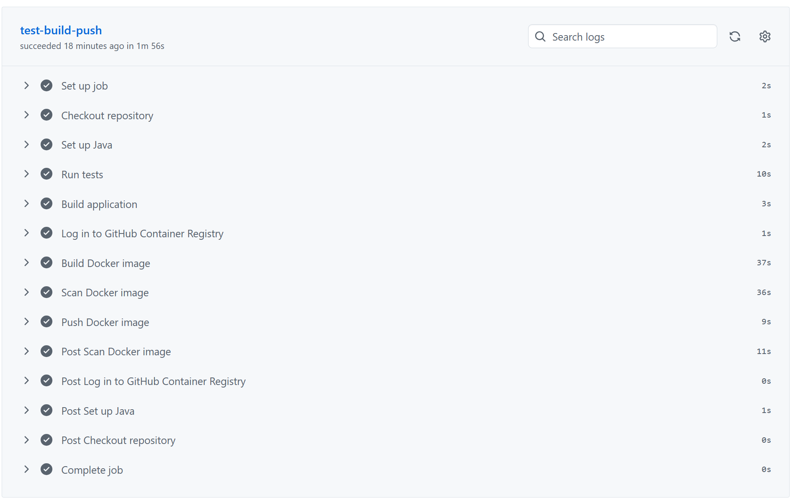
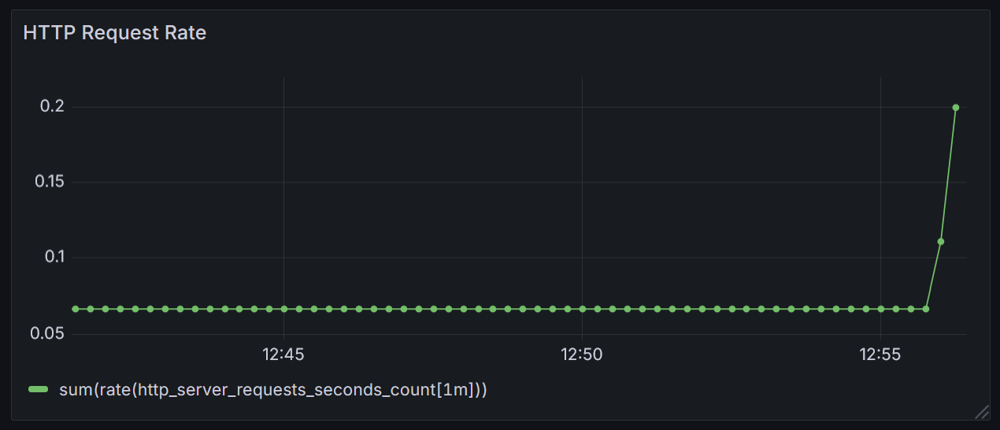
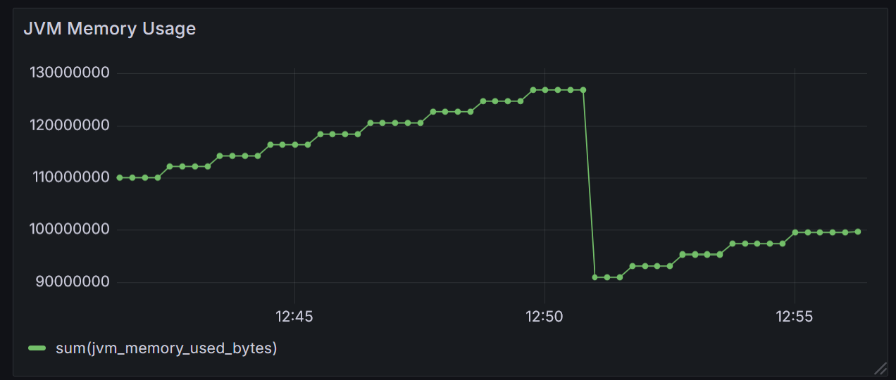
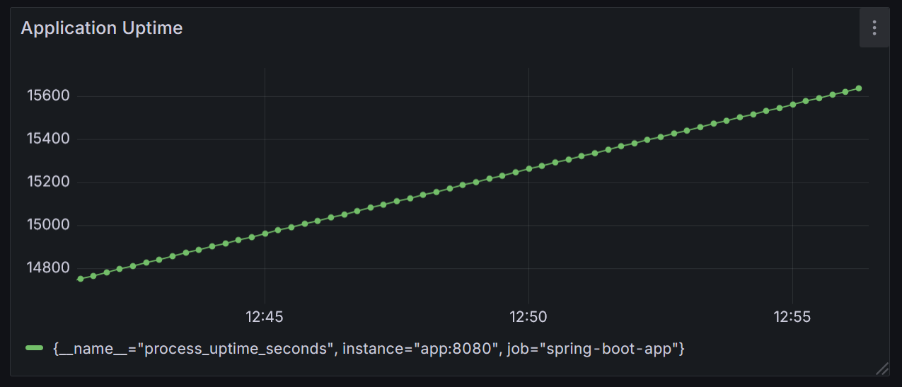
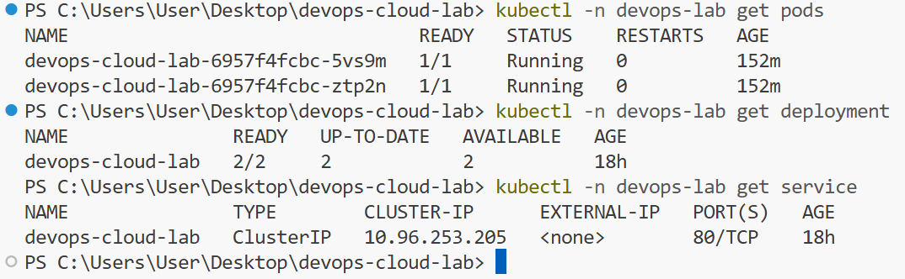
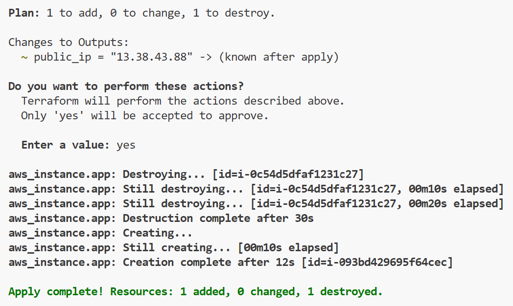

# DevOps Cloud Lab

A small end-to-end DevOps project built around a Spring Boot API.

The application itself is intentionally simple. The main goal of the project is to demonstrate containerisation, CI, security scanning, monitoring, Kubernetes orchestration, infrastructure as code, and cloud deployment.

## 📘 Detailed walkthrough

For a step-by-step explanation of how I built this project from scratch, including commands, troubleshooting and notes:

**[Read the full learning journal →](./MyNotes.md)**

---

## Architecture

```text
                     GitHub
                        │
                     git push
                        ↓
                 GitHub Actions
          ┌─────────────┼─────────────┐
          │             │             │
        Tests         Build         Trivy
          │             │             │
          └─────────────┴─────────────┘
                        ↓
                  Docker image
                        ↓
                       GHCR
                        │
          ┌─────────────┴─────────────┐
          ↓                           ↓
 Local Kubernetes                  AWS EC2
 Deployment + Pods                 Docker
          │                           │
          └────── Spring Boot API ────┘

Local monitoring:

Spring Boot
   ↓
Actuator
   ↓
Prometheus
   ↓
Grafana

AWS infrastructure:

Terraform
   ↓
EC2 instance
+
Security Group
```
---
## Screenshots

### CI pipeline

GitHub Actions automatically runs the tests, builds the application and Docker image, scans the image with Trivy, and publishes it to GitHub Container Registry.



### Monitoring with Grafana

#### HTTP request rate



#### JVM memory usage



#### Application uptime



### Kubernetes deployment

The application runs locally in Kubernetes with two replicas managed by a Deployment.



### Terraform / AWS deployment

Terraform provisions and updates the AWS infrastructure declaratively.



---

## Technologies

### Application
- Java 21
- Spring Boot
- Maven
- Spring Boot Actuator
- Micrometer

### Containers
- Docker
- Docker Compose
- GitHub Container Registry

### CI / DevSecOps
- GitHub Actions
- Trivy vulnerability scanner

### Monitoring
- Prometheus
- Grafana

### Kubernetes
- Kubernetes
- kind
- kubectl
- Deployment
- Pods
- Service
- ConfigMap
- readiness probe
- liveness probe

### Infrastructure
- Terraform
- AWS
- EC2
- Security Groups

---

## Application endpoints

The Spring Boot application exposes:

```text
GET /
GET /api/message
GET /api/counter
```

Monitoring endpoints:

```text
GET /actuator/health
GET /actuator/prometheus
```

Example:

```json
{
  "message": "Hello from DevOps Cloud Lab"
}
```

---

# Running locally

## 1. Run with Maven

```bash
mvn test
mvn spring-boot:run
```

Open:

```text
http://localhost:8080
```

---

## 2. Run with Docker

Build the image:

```bash
docker build -t devops-cloud-lab:local .
```

Run the container:

```bash
docker run --rm -p 8080:8080 devops-cloud-lab:local
```

Open:

```text
http://localhost:8080/api/message
```

---

# Docker Compose

Docker Compose starts:

- Spring Boot
- Prometheus
- Grafana

Run:

```bash
docker compose up --build
```

Services:

```text
Spring Boot
http://localhost:8080

Prometheus
http://localhost:9090

Grafana
http://localhost:3000
```

Grafana default credentials:

```text
username: admin
password: admin
```

Prometheus is available to Grafana inside the Docker network at:

```text
http://prometheus:9090
```

---

# Monitoring

Spring Boot Actuator exposes metrics at:

```text
/actuator/prometheus
```

Prometheus periodically scrapes these metrics.

Grafana queries Prometheus and displays them as dashboards.

Example PromQL queries:

### Application uptime

```promql
process_uptime_seconds
```

### JVM memory usage

```promql
sum(jvm_memory_used_bytes)
```

### HTTP request count

```promql
sum(http_server_requests_seconds_count)
```

### HTTP request rate

```promql
sum(rate(http_server_requests_seconds_count[1m]))
```

Monitoring flow:

```text
Spring Boot
   ↓
Actuator
   ↓
Prometheus
   ↓
Grafana
```

---

# CI pipeline

The GitHub Actions workflow runs automatically on pushes to `main`.

Pipeline:

```text
git push
   ↓
Checkout repository
   ↓
Set up Java
   ↓
Run Maven tests
   ↓
Build application
   ↓
Build Docker image
   ↓
Trivy security scan
   ↓
Push Docker image to GHCR
```

The Docker image is published to GitHub Container Registry:

```text
ghcr.io/<github-username>/devops-cloud-lab:latest
```

Each build also receives a tag based on the Git commit SHA.

Example:

```text
ghcr.io/<github-username>/devops-cloud-lab:a1b2c3d...
```

Using immutable commit-based tags makes it possible to identify the exact version of the application being deployed.

---

# Security scanning

Trivy scans the Docker image during CI.

The current configuration reports:

```text
HIGH
CRITICAL
```

vulnerabilities.

The scan currently uses:

```yaml
exit-code: 0
```

which means vulnerabilities are reported without failing the CI pipeline.

This can later be changed to:

```yaml
exit-code: 1
```

to block deployment when serious vulnerabilities are detected.

---

# Kubernetes

The project can also run inside a local Kubernetes cluster using `kind`.

Kubernetes resources are stored in:

```text
k8s/
├── namespace.yml
├── configmap.yml
├── deployment.yml
└── service.yml
```

Create the cluster:

```bash
kind create cluster --name devops-lab
```

Build the Docker image:

```bash
docker build -t devops-cloud-lab:local .
```

Load it into kind:

```bash
kind load docker-image devops-cloud-lab:local --name devops-lab
```

Deploy the application:

```bash
kubectl apply -f k8s/namespace.yml
kubectl apply -f k8s/configmap.yml
kubectl apply -f k8s/deployment.yml
kubectl apply -f k8s/service.yml
```

Check the pods:

```bash
kubectl -n devops-lab get pods
```

The Deployment maintains:

```text
2 replicas
```

---

## Kubernetes self-healing

If one pod is manually deleted:

```bash
kubectl -n devops-lab delete pod <pod-name>
```

the Deployment automatically creates a replacement.

This demonstrates Kubernetes desired-state reconciliation:

```text
Desired state = 2 pods
Actual state = 1 pod

Kubernetes detects the difference
        ↓
creates another pod
```

---

## Readiness and liveness probes

The Deployment uses Spring Boot Actuator endpoints:

```text
/actuator/health/readiness
/actuator/health/liveness
```

A container may be running while the application is not yet ready to receive traffic.

Kubernetes waits until the readiness probe succeeds before considering the pod available.

---

## ConfigMap

Application configuration is provided through a Kubernetes ConfigMap.

Example:

```yaml
data:
  APP_MESSAGE: "Hello from Kubernetes"
```

The Deployment injects this value into the container as an environment variable.

Spring Boot then reads:

```text
APP_MESSAGE
```

without requiring a new application build.

---

## Rolling update

A Deployment can be restarted with:

```bash
kubectl -n devops-lab rollout restart deployment devops-cloud-lab
```

The rollout can be monitored using:

```bash
kubectl -n devops-lab get pods -w
```

Kubernetes gradually creates new pods and removes the old ones only after the new pods become ready.

---

# Terraform

AWS infrastructure is defined using Terraform.

Files:

```text
terraform/aws-ec2/
├── main.tf
├── variables.tf
├── outputs.tf
└── versions.tf
```

The Terraform configuration creates:

```text
AWS EC2 instance
+
AWS Security Group
```

Terraform workflow:

```bash
terraform init
terraform validate
terraform plan
terraform apply
```

The public IP is available with:

```bash
terraform output public_ip
```

---

# AWS deployment

Terraform provisions an Amazon Linux EC2 instance.

The instance automatically:

```text
boots
↓
installs Docker
↓
starts Docker
↓
pulls the application image from GHCR
↓
runs the Spring Boot container
```

The application is then accessible using:

```text
http://<EC2_PUBLIC_IP>:8080/api/message
```

Infrastructure flow:

```text
Terraform
   ↓
AWS API
   ↓
EC2
   ↓
Docker
   ↓
GHCR image
   ↓
Spring Boot
```

---

# Infrastructure cleanup

The AWS resources can be removed using:

```bash
terraform destroy
```

Terraform tracks the infrastructure it created and can destroy it when it is no longer needed.

This avoids keeping unnecessary cloud resources running.

---

# Repository structure

```text
devops-cloud-lab/
│
├── src/
│   ├── main/
│   └── test/
│
├── .github/
│   └── workflows/
│       └── ci.yml
│
├── k8s/
│   ├── namespace.yml
│   ├── configmap.yml
│   ├── deployment.yml
│   └── service.yml
│
├── monitoring/
│   └── prometheus.yml
│
├── terraform/
│   └── aws-ec2/
│       ├── main.tf
│       ├── variables.tf
│       ├── outputs.tf
│       └── versions.tf
│
├── Dockerfile
├── compose.yaml
├── pom.xml
└── README.md
```

---

# What this project demonstrates

This project demonstrates a complete DevOps workflow:

- building and testing a Java application
- containerising it with Docker
- automating builds with GitHub Actions
- publishing images to a container registry
- scanning container images for vulnerabilities
- collecting application metrics
- visualising metrics with Grafana
- orchestrating containers with Kubernetes
- using health and readiness probes
- managing application configuration with ConfigMaps
- demonstrating Kubernetes self-healing and rolling updates
- defining infrastructure as code with Terraform
- provisioning a cloud server on AWS
- automatically deploying a Docker container on EC2

---

# Possible improvements

Future improvements could include:

- automatic deployment after CI
- HTTPS
- reverse proxy with Nginx
- Terraform remote state
- GitHub Actions CD pipeline
- Kubernetes Secrets
- PostgreSQL
- Helm charts
- Kubernetes monitoring
- stricter Trivy security gates
- AWS ECR
- AWS ECS or EKS
- centralized logs
```
